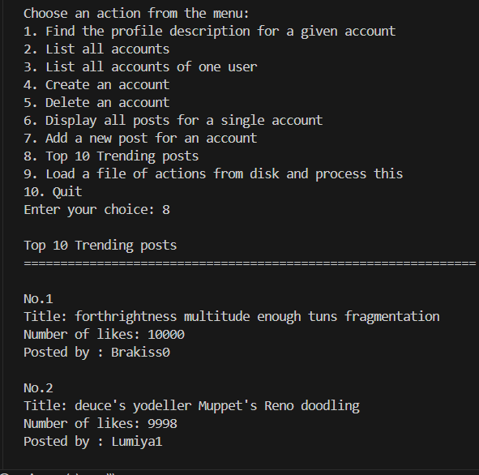
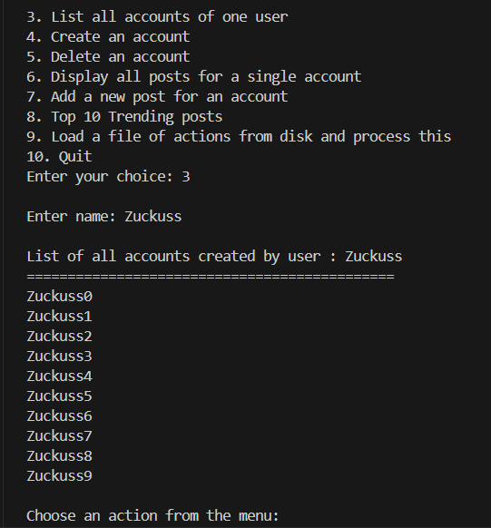
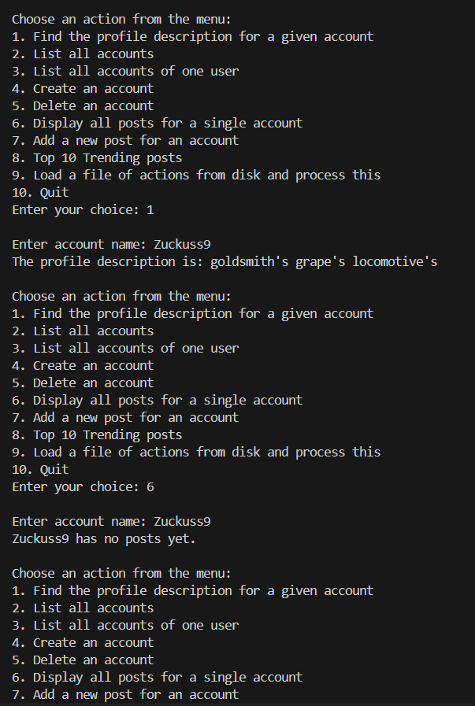

# TokTik 


TokTik is a Java terminal application built with a binary search tree data structure. It allows users to manage accounts and posts, akin to a simplified social media platform. This README provides an overview of the project, installation instructions, usage guide, and more.

## Overview 🚀

TokTik is a Java-based terminal application designed to manage user accounts and posts. It utilizes a binary search tree data structure to efficiently organize and retrieve account information. With TokTik, users can create accounts, add posts, delete accounts, and view trending posts.

## Installation 🛠️

To run TokTik locally, follow these steps:

1. Clone the repository:
    ```bash
    git clone https://github.com/LuthoYRN/toktik.git
    ```
2. Navigate to the project directory:
    ```bash
    cd toktik
    ```
3. Compile the Java source files:
    ```bash
    make
    ```
4. Run the application:
    ```bash
    make run
    ```

## Usage ℹ️

TokTik provides a simple and intuitive user interface within the terminal. Follow the on-screen prompts to perform various actions, such as creating accounts, adding posts, and viewing trending posts.

## Features ✨

- Create and manage user accounts
- Add, delete, and display posts
- View trending posts
- Efficient data organization using binary search trees

## Screenshots 📷
<div style = "display: flex;flex-direction: row;justify-content: space-between;">
    
    
    
</div>

